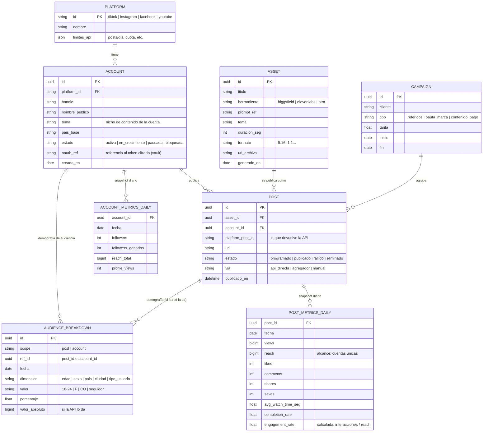
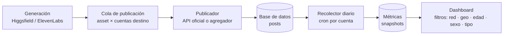

# Esquema de datos — On Cue

Modelo de datos para operar una red de cuentas propias (5 → 50–100) en TikTok, Instagram, Facebook y YouTube, publicar video corto generado con IA (Higgsfield / ElevenLabs) vía API, y analizar rendimiento segmentado por **red social, geografía, edad, sexo y tipo de usuario**.

## Principio de diseño

Separamos tres conceptos que suelen mezclarse y que aquí importan mucho:

1. **Asset** — el video generado con IA (existe una vez, se produce con Higgsfield/ElevenLabs).
2. **Post** — una publicación concreta de ese asset en UNA cuenta de UNA red. Un mismo asset puede publicarse en 20 cuentas → 20 posts, cada uno con sus propias métricas.
3. **Snapshot de métricas** — las métricas se leen por API cada día y se guardan como serie temporal (nunca se sobreescriben), para poder ver crecimiento y comparar períodos.

Y una restricción real del ecosistema que el esquema debe reflejar: **no todas las plataformas exponen demografía al mismo nivel**. YouTube da edad/sexo/país **por video**; TikTok y Meta la dan principalmente **a nivel de cuenta/audiencia**. Por eso la tabla de demografía lleva un campo `scope` (`post` | `account`) en lugar de asumir que siempre hay desglose por video.

## Diagrama entidad-relación

## Dimensiones de segmentación (las que pide el dashboard)

| Dimensión | Valores | Fuente por plataforma |
|---|---|---|
| **Red social** | tiktok, instagram, facebook, youtube | propia del post |
| **Geografía** | país (ISO-3166), ciudad donde exista | YT: por video · TikTok/IG: audiencia de cuenta |
| **Edad** | 13–17, 18–24, 25–34, 35–44, 45–54, 55+ | YT: por video · TikTok/IG: audiencia de cuenta |
| **Sexo** | F, M, no especificado | igual que edad |
| **Tipo de usuario** | seguidor / no seguidor (y ampliable: nuevo vs recurrente) | TikTok e IG lo dan por contenido (reach de seguidores vs no) |

La lista de dimensiones es abierta a propósito: `AUDIENCE_BREAKDOWN.dimension` es un string, así que agregar "dispositivo" o "fuente de tráfico" mañana no requiere migración, solo un valor nuevo.

## Métricas derivadas (se calculan, no se almacenan crudas)

- **Engagement rate** = (likes + comments + shares + saves) / reach
- **Tasa de finalización** = completions / views (donde la red la dé)
- **Crecimiento de seguidores** = Δ followers período vs período anterior
- **Alcance por seguidor** (eficiencia viral) = reach / followers de la cuenta
- **Score de video** (para ranking interno): combinación ponderada de reach, ER y completion — los pesos se calibran cuando haya data real.

## Pipeline de datos

1. **Generación**: el asset se produce y se registra con su metadata (tema, prompt, duración).
2. **Publicación**: por cada asset se decide en qué cuentas sale (no siempre en todas — contenido duplicado idéntico en muchas cuentas es señal de spam para las plataformas; ver investigación de políticas). El publicador llama la API correspondiente y guarda el `platform_post_id`.
3. **Recolección**: un job diario por cuenta pide métricas de cada post activo y de la cuenta, y las inserta como snapshot del día.
4. **Dashboard**: lee de los snapshots; todos los filtros operan sobre las mismas tablas.

## Almacenamiento sugerido para empezar

Con 5–100 cuentas y decenas de videos/semana el volumen es pequeño: **Postgres** (Supabase para ir rápido) sobra durante mucho tiempo. Los snapshots diarios de 100 cuentas × ~50 posts activos son ~5.000 filas/día — años de datos sin problema. No hace falta warehouse hasta mucho después.
